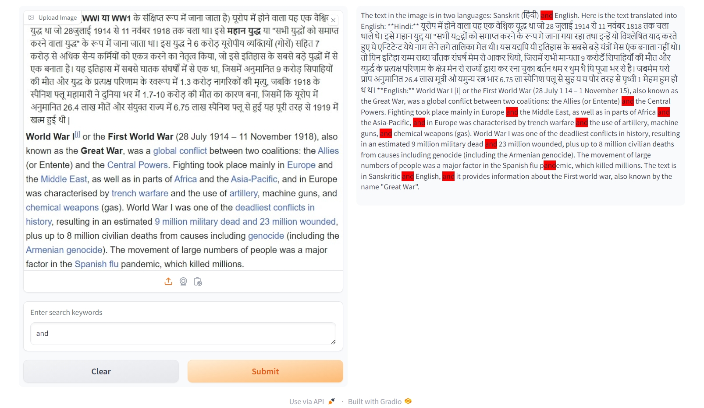

# Image-OCR-and-Search-model02
Developed and deployed a web-based prototype that demonstrates the ability to perform Optical Character Recognition (OCR) on an uploaded image (in picture format) containing text in both Hindi and English using Qwen2-VL.

### Setup and Installation
1. **Clone the repository**
   ```bash
   git clone https://github.com/Tejas1206/Image-OCR-and-Search.git
   cd Image-OCR-and-Search
   ```
2. **Set up a Virtual Environment**
   ```Shell
    python3 -m venv venv
    venv\Scripts\activate  
    ```
3. **Install the required dependencies**
   ```Shell
    pip install -r requirements.txt  
    ```
4. **Run the Jupyter Notebook 'assignment.ipynb' to run the web app locally**
   ```Shell
    jupyter notebook  
    ```
   
**Usage:**
<li>Upload an image containing Hindi and English text.</li>
<li>View the extracted text displayed in the app.</li>
<li>Enter keywords to search and view highlighted results.</li><br>

**Screenshot:**



### Acknowledgement

- [Qwen2-VL](https://github.com/QwenLM/Qwen2-VL): OCR documentation
- [Qwen2-VL-2B-Instruct](https://huggingface.co/Qwen/Qwen2-VL-2B-Instruct/): OCR Model used
- [Gradio](https://www.gradio.app/docs): For web application
- [huggingface](https://huggingface.co/): For deploying web application

